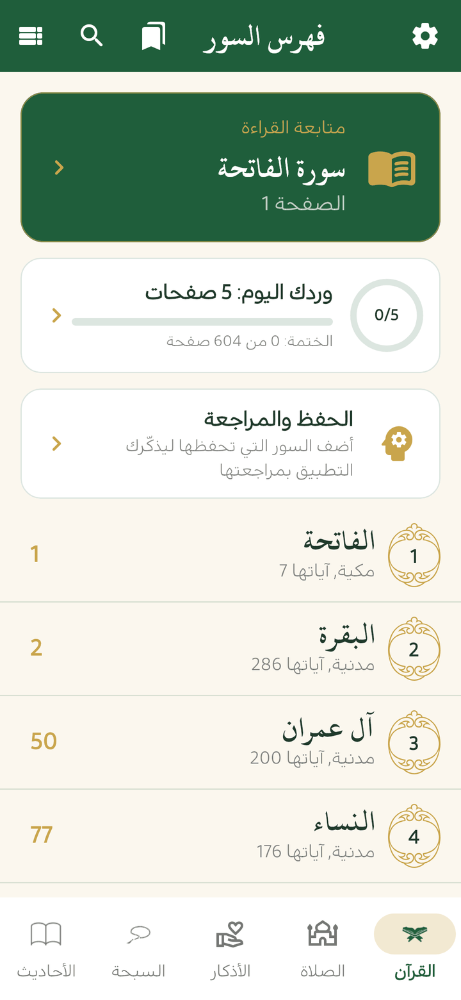
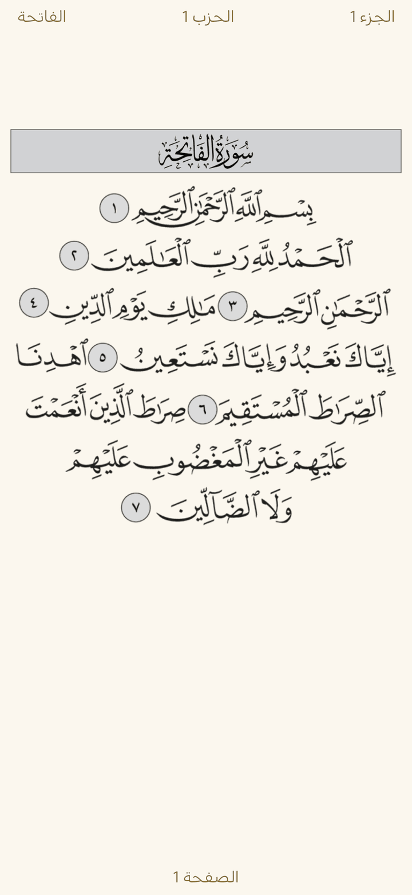
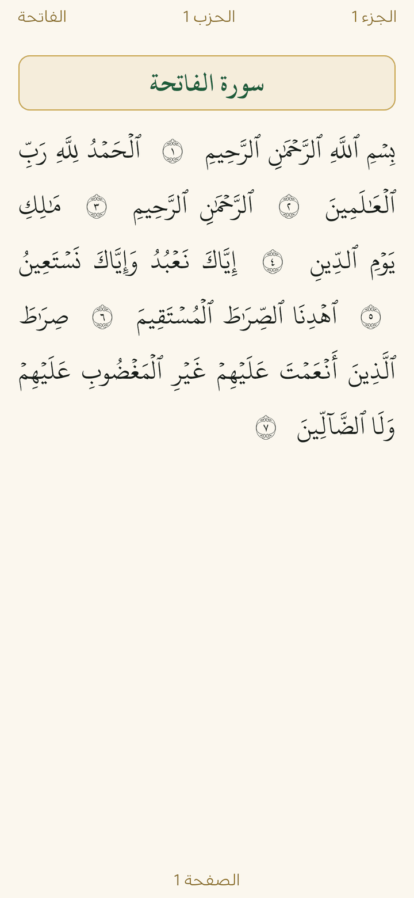
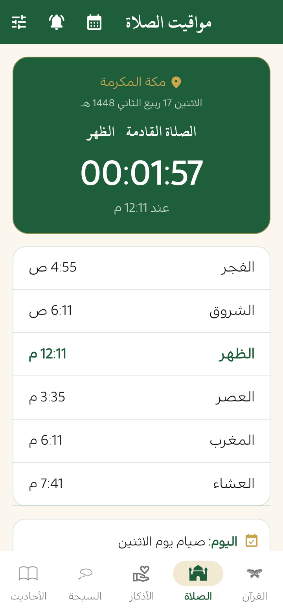
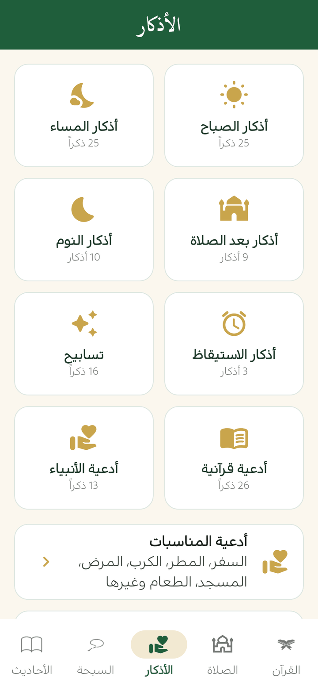
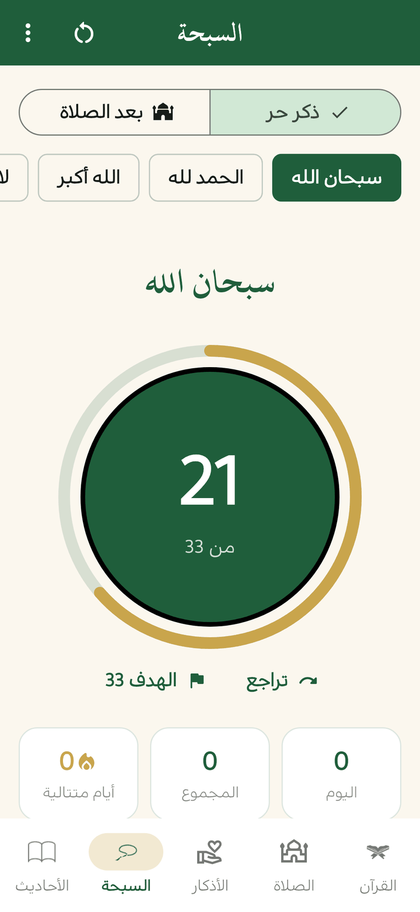

# منهج حياة — تطبيق القرآن والأحاديث والسبحة (Flutter)

تطبيق عربي يعمل دون إنترنت، مبني بـ Flutter.

<p align="center">
  
  
  
  
  
  
</p>

## الميزات
- 📖 **مصحف المدينة كاملاً** (604 صفحات) مع فهرس السور والأجزاء والأحزاب، وحفظ آخر صفحة وعلامة مرجعية.
- 👆 **اضغط مطوّلاً على أي آية في المصحف** لتظهر مميّزة مع: تفسيرها، والاستماع من عندها، ومشاركتها كصورة، ونسخها. وتُميَّز الآية التي تُتلى أثناء الاستماع. (مواضع الآيات مستخرجة من صور الصفحات نفسها بالأداة `tool/build_ayah_regions.py` ومتحقَّق منها آلياً)
- ✍️ **ملاحظات التدبّر**: اكتب خاطرتك على أي آية من قائمة الضغط المطوّل، وتجد كل ملاحظاتك مع البحث فيها من زر الملاحظات في تبويب القرآن، وتدخل في النسخة الاحتياطية.
- 🔍 **تكبير صفحة المصحف** بإصبعين أو بالنقر مرتين، والتنقّل داخلها وهي مكبّرة.
- 🔤 **القراءة نصاً**: يعرض المصحف صفحةً صفحةً نصاً بالخط العثماني وبحجم الخط الذي تختاره، مع الضغط المطوّل على الآيات وتمييز الآية المتلوّة. زر التبديل في أدوات المصحف.
- 🕌 **مواقيت الصلاة** تُحسب على الهاتف دون إنترنت (من موقعك أو من قائمة مدن)، مع العد التنازلي للصلاة القادمة، واتجاه القبلة، واختيار طريقة الحساب والمذهب في العصر.
- 🧭 **بوصلة القبلة** تستخدم حساسات الهاتف وتخبرك بالاتجاه والدرجات حتى تتجه إلى القبلة.
- 📅 **التاريخ الهجري** (تقويم أم القرى مع إمكانية تعديله ±يومين) وتنبيه بالأيام الفاضلة: عرفة، عاشوراء، الأيام البيض، الاثنين والخميس، الست من شوال، العشر من ذي الحجة، مع مراعاة أيام العيد والتشريق، مع **تقويم هجري شهري** يعرض التاريخين معاً ويميّز الأيام الفاضلة.
- 🌙 **رمضان**: إمساكية الشهر كاملة لمدينتك (الإمساك، الفجر، المغرب)، وعدّ تنازلي للإفطار ولانتهاء السحور، وعدّ للأيام الباقية من منتصف شعبان، وتذكير بالسحور قبل الفجر، وزر لاعتماد ختمة رمضان (جزء يومياً).
- 📱 **ودجت للشاشة الرئيسية** (أندرويد): الصلاة القادمة ووقتها ومواقيت اليوم، يتحدّث تلقائياً عند كل صلاة. أضفه بالضغط المطوّل على الشاشة الرئيسية ← الودجت ← منهج حياة.
- 🔔 **التنبيهات**: عند دخول وقت كل صلاة، وتذكير قبل الصلاة بدقائق، وتذكير بأذكار الصباح والمساء، وبالورد إن لم يكتمل، وتذكير يوم الجمعة بسورة الكهف (يفتحها مباشرة) وبالدعاء في آخر ساعة قبل المغرب. ويمكن اختيار **صوت الأذان** لتنبيه دخول الوقت من أصوات الهاتف أو باستيراد ملف صوتي (مثل أذان تحمّله بنفسك). و**تذكير بصيام التطوّع** مساء اليوم السابق: عرفة، عاشوراء وتاسوعاء، الأيام البيض، الست من شوال، والاثنين والخميس (اختياري).
- 📈 **الورد اليومي والختمة**: هدف صفحات يومي، تتبّع تلقائي للصفحات المقروءة، نسبة الختمة وموعد إتمامها المتوقع، ورسم لآخر 7 أيام.
- 👥 **الختمة الجماعية** دون خادم ولا تسجيل: وزّع الأجزاء الثلاثين على المشاركين، وشارك رسالة الختمة في واتساب، ومن يلصقها في التطبيق يرى جزأه ويفتحه في المصحف، ثم يرسل رسالة إنجاز يلصقها المنظّم لتحديث التقدّم.
- 🎧 **الاستماع للتلاوة** آية آية لصفحة المصحف المفتوحة، مع اختيار القارئ (العفاسي، الحصري، المنشاوي، عبد الباسط، السديس، المعيقلي، الشريم وغيرهم)، وتكرار كل آية للحفظ، و**تكرار مقطع كامل** (من آية إلى آية وعدد مرات تختاره)، و**مؤقت نوم**، والانتقال التلقائي للصفحة التالية. ويمكن **تحميل السور للاستماع دون إنترنت** (سورة سورة، أو جزء عمّ، أو القرآن كاملاً). المصدر [alquran.cloud](https://alquran.cloud)
- 📚 **التفسير الميسر** لكل آية: من صفحة المصحف المفتوحة أو من نتائج البحث، مع التنقل بين الصفحات.
- 📖 **تفاسير أخرى**: السعدي، والمختصر في التفسير، وابن كثير، والقرطبي؛ يُحمَّل كل تفسير سورةً سورةً عند أول فتح ثم يبقى على الهاتف (زر اختيار التفسير في شاشة التفسير).
- 🌍 **ترجمة معاني القرآن بالإنجليزية** (صحيح إنترناشونال) تظهر مع التفسير ونتائج البحث وعند الضغط على آية، مع **البحث بالكلمات الإنجليزية** في المعاني. تُفعَّل تلقائياً في الواجهة الإنجليزية ويمكن تشغيلها من الإعدادات.
- 🗣️ **ترجمات المعاني بلغات أخرى** تُحمَّل عند اختيارها: الأوردية، الإندونيسية، التركية، الفرنسية، البنغالية، الروسية، الإسبانية، الصينية، السويدية (من الإعدادات ← لغة الترجمة).
- 🧠 **الحفظ والمراجعة**: أضف السور التي تحفظها، ويذكّرك التطبيق بمراجعتها على فترات متباعدة (يوم، 3 أيام، أسبوع، أسبوعان، شهر، شهران)، مع وضع «اختبر نفسك» الذي يخفي الآيات حتى تستحضرها.
- 🔍 **البحث في القرآن** بكلمة أو جزء من آية أو اسم سورة، والانتقال مباشرة إلى صفحتها.
- ✨ **آية اليوم وحديث اليوم**: بطاقة آية في تبويب القرآن (مع إشعار صباحي اختياري)، وحديث من رياض الصالحين في تبويب الأحاديث، ويمكن مشاركتهما كصورة.
- 🖼️ **المشاركة كصورة**: شارك أي آية أو حديث أو ذكر أو دعاء كبطاقة بالأخضر والذهبي (أو بخلفية فاتحة) مع ذكر المصدر.
- 🕌 **الأحاديث النبوية**: الأربعون النووية، والأربعون القدسية، ورياض الصالحين كاملاً (1896 حديثاً) مع البحث فيه.
- 🤲 **أدعية المناسبات** من حصن المسلم (السفر، المطر، الكرب، المرض، المسجد، الطعام وغيرها) مع البحث، و**الرقية الشرعية** من القرآن والسنة، و**أسماء الله الحسنى**.
- 🤲 **الأذكار** من حصن المسلم: الصباح، المساء، بعد الصلاة، النوم، الاستيقاظ، التسابيح، والأدعية القرآنية وأدعية الأنبياء، مع عدّاد لكل ذكر يُحفظ طوال اليوم.
- 📿 **سبحة إلكترونية**: اختيار الذكر والعدد المطلوب، إضافة أذكار خاصة، وضع «بعد الصلاة» (33/33/33 ثم التهليل)، وإحصاءات يومية وأيام متتالية، و**العدّ بأزرار الصوت** دون النظر إلى الشاشة (اختياري، من قائمة السبحة).
- 🔖 **علامات مرجعية متعددة**.
- 🌐 **واجهة بالعربية أو الإنجليزية** (English UI) من الإعدادات أو من شاشة الترحيب، مع بقاء القرآن والأحاديث والأذكار بالعربية.
- ♿ **دعم قارئ الشاشة**: أوصاف للأزرار وعدّاد السبحة وصفحات المصحف.
- ⚙️ **الإعدادات**: حجم خط قابل للتعديل للأحاديث والأذكار والأدعية، واختيار المظهر، و**نسخ احتياطي واستعادة** لكل البيانات في ملف، و**سجل أخطاء** يبقى على الهاتف يمكن مشاركته مع المطوّر عند حدوث مشكلة.
- 🌙 **وضع ليلي** يتبع إعداد الجهاز تلقائياً ويمكن تغييره من داخل المصحف.
- 🤲 دعاء ختم القرآن.

## التشغيل
يتطلب Flutter 3.38 أو أحدث.

```bash
git clone https://github.com/AlaaBashirSaijary/Quran.git
cd Quran
flutter pub get
flutter run
```

## الاختبارات
```bash
flutter test
```

## تحميل التطبيق على الهاتف
افتح صفحة **[آخر إصدار](https://github.com/AlaaBashirSaijary/Quran/releases/latest)** من هاتفك، وحمّل `manhaj-hayah.apk` من قسم **Assets** ثم افتحه للتثبيت. لا يلزم تسجيل الدخول إلى GitHub.

- `manhaj-hayah.apk`: يعمل على أي هاتف Android (الأسهل).
- `manhaj-hayah-arm64-v8a.apk`: أصغر حجماً، لمعظم الهواتف الحديثة.
- `manhaj-hayah-armeabi-v7a.apk`: للهواتف القديمة.

## البناء التلقائي (CI/CD)
عند كل `push` إلى أي فرع يقوم GitHub Actions بتحليل الكود وتشغيل الاختبارات وبناء ملفات APK (تجدها أيضاً في تبويب **Actions** ضمن **Artifacts**).
وعند كل دمج في `master` يُنشر **إصدار جديد** تلقائياً (`v1.0.<رقم البناء>`) عليه ملفات APK للتحميل المباشر. يمكن أيضاً نشر إصدار باسم محدد برفع tag يبدأ بـ `v`:
```bash
git tag v2.0.0
git push origin v2.0.0
```

### مفتاح التوقيع (مهم للتحديثات)
بدون مفتاح توقيع ثابت، تُوقَّع كل نسخة بمفتاح عشوائي جديد، فيرفض الهاتف تثبيت النسخة الجديدة فوق القديمة (يجب حذف التطبيق أولاً). لإصلاح ذلك مرة واحدة:

1. أنشئ مفتاحاً على جهازك (يحتاج Java) واحتفظ به وبكلمة المرور في مكان آمن — إن ضاع لن تستطيع تحديث التطبيق:
   ```bash
   keytool -genkey -v -keystore upload-keystore.jks -keyalg RSA -keysize 2048 -validity 10000 -alias upload
   base64 -w 0 upload-keystore.jks > keystore.txt
   ```
2. في GitHub: **Settings ← Secrets and variables ← Actions ← New repository secret**، وأضف:
   - `ANDROID_KEYSTORE_BASE64`: محتوى `keystore.txt`
   - `ANDROID_KEYSTORE_PASSWORD`: كلمة مرور المفتاح
   - `ANDROID_KEY_ALIAS`: `upload`
   - `ANDROID_KEY_PASSWORD`: كلمة مرور المفتاح

لا ترفع ملف `upload-keystore.jks` إلى المستودع أبداً.

## تجربة التطبيق على الهاتف
قائمة قصيرة بما يلزم تجربته على هاتف حقيقي بعد كل إصدار مهم: [docs/phone-test-checklist.md](docs/phone-test-checklist.md).

## النشر على Google Play
الخطوات ونصوص صفحة المتجر وإجابات «أمان البيانات» في [docs/google-play.md](docs/google-play.md)، وسياسة الخصوصية في [docs/privacy-policy.md](docs/privacy-policy.md). بعد إضافة مفتاح التوقيع إلى أسرار GitHub يُرفق CI ملف `manhaj-hayah.aab` بكل إصدار.

## بناء نسخة Android بأصغر حجم
صفحات المصحف هي الجزء الأكبر من حجم التطبيق (حوالي 39 ميغابايت). لتجنب إضافة حجم فوق ذلك:

```bash
# لرفعه على Google Play (المتجر يرسل لكل جهاز ما يحتاجه فقط)
flutter build appbundle --release

# أو ملفات APK منفصلة لكل نوع معالج بدل ملف واحد كبير
flutter build apk --release --split-per-abi
```

## مصادر البيانات
- نص القرآن المستخدم في البحث (الرسم العثماني) من [الموسوعة القرآنية quranenc.com](https://quranenc.com) عبر حزمة [quran-json](https://github.com/risan/quran-json)، وأرقام الصفحات من حزمة [quran-meta](https://github.com/quran-center/quran-meta)، وقد طوبقت مع بيانات صفحات المصحف في التطبيق.
- ترجمة معاني القرآن بالإنجليزية: صحيح إنترناشونال (أم محمد) من [tanzil.net](https://tanzil.net/trans/en.sahih) عبر حزمة [quran-json](https://github.com/risan/quran-json)، كما هي دون تعديل.
- ترجمات المعاني الأخرى من [tanzil.net](https://tanzil.net/trans/) و[quranenc.com](https://quranenc.com) عبر حزمة [quran-json](https://github.com/risan/quran-json) (المترجمون مذكورون في التطبيق).
- مواضع الآيات على صفحات المصحف مستخرجة من صور الصفحات بالأداة `tool/build_ayah_regions.py`، التي تتحقق من ترقيم كل الآيات (6236) مقابل عناوين السور.
- التفسير الميسر (مجمع الملك فهد) من [quran.com](https://quran.com) عبر مستودع [tafsir_api](https://github.com/spa5k/tafsir_api)، كما هو دون تعديل.
- التفاسير الإضافية (السعدي، المختصر، ابن كثير، القرطبي) من مستودع [tafsir_api](https://github.com/spa5k/tafsir_api) (بيانات quran.com وQUL من Tarteel)، كما هي دون تعديل.
- الأربعون القدسية ورياض الصالحين من [sunnah.com](https://sunnah.com) عبر مستودع [hadith-json](https://github.com/AhmedBaset/hadith-json) (الإصدار v1.2.0).
- أبواب حصن المسلم كاملة من حزمة [@kazishariar/hisnul-muslim-data](https://www.npmjs.com/package/@kazishariar/hisnul-muslim-data)، والأسماء الحسنى من قاعدة بيانات [react-native-prayer-times](https://www.npmjs.com/package/@shkomaghdid/react-native-prayer-times) مع تصحيح تشكيل ثمانية أسماء (مثل ٱلْرَّافِعُ ← ٱلرَّافِعُ).
- الأذكار من كتاب حصن المسلم عبر [islambook.com](https://www.islambook.com/) (من مستودع [azkar-api](https://github.com/nawafalqari/azkar-api))، مع حذف حروف المدّ الزائدة وتصحيح المسافات فقط دون تغيير النص.
